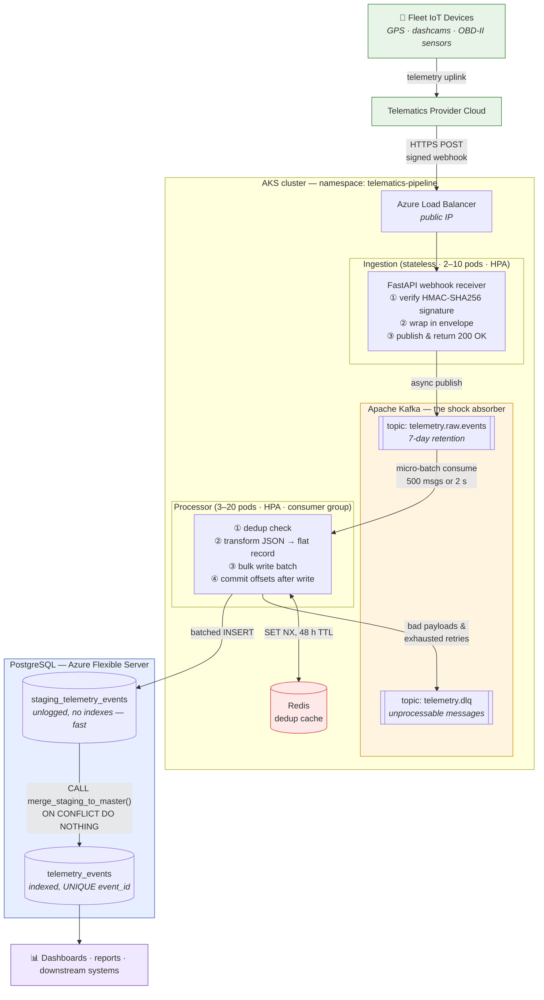
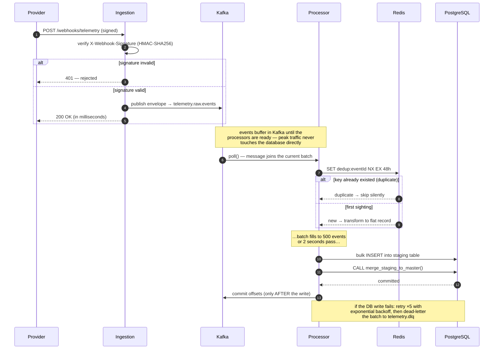
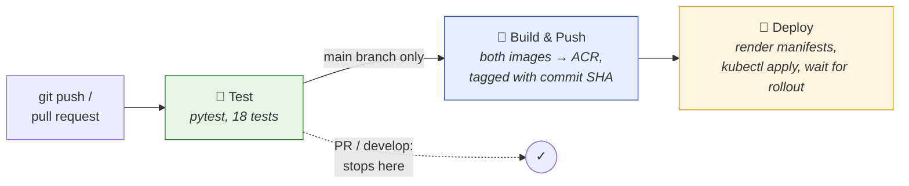
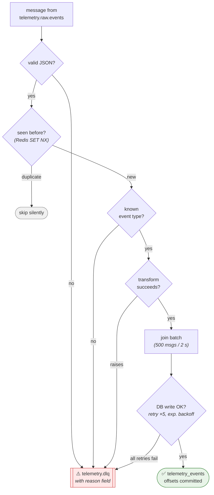

# Fleet Telematics Pipeline

A production-grade data pipeline that ingests real-time IoT telematics events — GPS positions, driver safety alerts, engine fault codes, geofence crossings — from a fleet telematics provider's webhooks and streams them into a relational database. Built to run on **Azure Kubernetes Service (AKS)**.

The codebase is deliberately heavily commented: every design decision (why Kafka sits in the middle, why there's a Redis cache, why writes go through a staging table) is explained inline where it happens. If you're newer to data engineering, reading the source top-to-bottom in the order below is a guided tour of event-driven pipeline design:

1. [ingestion/main.py](ingestion/main.py) — receiving and verifying webhooks
2. [processor/main.py](processor/main.py) — the consume → transform → batch-write loop
3. [processor/transformer.py](processor/transformer.py) — flattening nested JSON for SQL
4. [processor/deduplication.py](processor/deduplication.py) — why duplicates happen and how to stop them
5. [processor/db_writer.py](processor/db_writer.py) + [sql/001_schema.sql](sql/001_schema.sql) — writing fast without hurting the database

---

## Architecture Overview



### One event's journey

What happens to a single GPS ping, end to end — including the unhappy paths:



### Why is it built this way?

| Decision | Rationale |
|----------|-----------|
| **Kafka between ingestion and the database** | Fleet traffic is bursty — hundreds of vehicles start routes around 8 AM. Kafka absorbs the spike and lets the processors drain it at a steady pace. If the database goes down for hours, events simply wait in Kafka. |
| **Redis idempotency cache** | Webhook providers retry deliveries on any slow response, so the same event can arrive twice. An atomic `SET NX` with a 48h TTL skips repeats in sub-millisecond time. |
| **Staging table + merge procedure** | Inserting into an unindexed, unlogged staging table is far cheaper than hitting the indexed production table row-by-row. A stored procedure then merges each batch in one set-based statement. |
| **HMAC-SHA256 webhook verification** | Anyone on the internet can POST to a public endpoint. The signature check proves the payload came from the provider and wasn't tampered with. |
| **Dead Letter Queue (DLQ)** | One malformed payload must not stall millions of good ones. Unprocessable messages are parked on `telemetry.dlq` for human inspection. |
| **At-least-once delivery + dedup** | Kafka offsets are committed only *after* a batch lands in the database. A crash means re-processing, never silent loss — and the dedup layers absorb the re-processing. |

---

## Repository Structure

```
fleet-telematics-pipeline/
├── ingestion/              # FastAPI webhook receiver service
│   ├── main.py             # Signature check + publish to Kafka
│   ├── config.py           # Env-driven settings (pydantic-settings)
│   ├── requirements.txt
│   └── Dockerfile
├── processor/              # Kafka consumer + database writer service
│   ├── main.py             # Consume loop, batching, offset commits, DLQ
│   ├── transformer.py      # Event type → flat record mapping (registry pattern)
│   ├── deduplication.py    # Redis idempotency cache
│   ├── db_writer.py        # Bulk insert via execute_values + merge call
│   ├── config.py
│   ├── requirements.txt
│   └── Dockerfile
├── k8s/                    # Kubernetes manifests (commented for newcomers)
│   ├── namespace.yaml
│   ├── configmap.yaml      # Non-secret config → env vars
│   ├── secrets.yaml        # Template ONLY — see comments inside
│   ├── ingestion/          # Deployment, LoadBalancer Service, HPA (2→10 pods)
│   ├── processor/          # Deployment, HPA (3→20 pods)
│   ├── kafka/              # Single-broker StatefulSet (dev/staging only)
│   ├── redis/              # Dedup cache
│   └── postgres/           # In-cluster Postgres (dev/staging only)
├── sql/
│   └── 001_schema.sql      # Tables + merge stored procedure (commented)
├── scripts/
│   ├── setup-aks.sh        # One-time Azure provisioning (RG, ACR, AKS, PG)
│   └── deploy.sh           # Build → push → render manifests → apply
├── tests/                  # Unit tests — no live services needed
│   ├── conftest.py
│   ├── test_ingestion.py
│   ├── test_transformer.py
│   ├── test_deduplication.py
│   └── requirements.txt
├── .github/workflows/
│   └── ci.yml              # GitHub Actions: test → build → push → deploy
├── .env.example            # Template for local development settings
└── README.md
```

---

## Prerequisites

| Tool | Minimum Version | Needed for |
|------|----------------|------------|
| Python | 3.12 (3.13 works) | Local development & tests |
| Docker | 24+ | Building images, local Kafka/Redis/Postgres |
| kubectl | 1.29+ | Talking to the AKS cluster |
| Azure CLI (`az`) | 2.60+ | Provisioning Azure resources |

Install the Azure CLI: https://learn.microsoft.com/en-us/cli/azure/install-azure-cli

---

## Quick Start (Local Development)

### 1. Clone and configure

```bash
git clone https://github.com/albertlok/fleet-telematics-pipeline.git
cd fleet-telematics-pipeline
cp .env.example .env        # defaults work for the docker containers below
```

### 2. Start Kafka, Redis, and PostgreSQL in Docker

```bash
docker network create telemetry-dev

docker run -d --name redis --network telemetry-dev -p 6379:6379 redis:7-alpine

docker run -d --name postgres --network telemetry-dev \
  -p 5432:5432 \
  -e POSTGRES_DB=telemetry \
  -e POSTGRES_USER=fleet \
  -e POSTGRES_PASSWORD=fleet \
  postgres:16-alpine

docker run -d --name kafka --network telemetry-dev \
  -p 9092:9092 \
  -e KAFKA_NODE_ID=1 \
  -e KAFKA_PROCESS_ROLES=broker,controller \
  -e KAFKA_LISTENERS=PLAINTEXT://:9092,CONTROLLER://:9093 \
  -e KAFKA_ADVERTISED_LISTENERS=PLAINTEXT://localhost:9092 \
  -e KAFKA_LISTENER_SECURITY_PROTOCOL_MAP=PLAINTEXT:PLAINTEXT,CONTROLLER:PLAINTEXT \
  -e KAFKA_CONTROLLER_QUORUM_VOTERS=1@kafka:9093 \
  -e KAFKA_CONTROLLER_LISTENER_NAMES=CONTROLLER \
  -e KAFKA_OFFSETS_TOPIC_REPLICATION_FACTOR=1 \
  apache/kafka:3.7.0
```

### 3. Create Kafka topics

```bash
docker exec kafka /opt/kafka/bin/kafka-topics.sh \
  --bootstrap-server localhost:9092 --create --if-not-exists \
  --topic telemetry.raw.events --partitions 1 --replication-factor 1

docker exec kafka /opt/kafka/bin/kafka-topics.sh \
  --bootstrap-server localhost:9092 --create --if-not-exists \
  --topic telemetry.dlq --partitions 1 --replication-factor 1
```

### 4. Create the database schema

```bash
docker exec -i postgres psql -U fleet -d telemetry -f - < sql/001_schema.sql
```

### 6. Run the ingestion service (terminal 1)

```bash
cd ingestion
python3 -m venv .venv && source .venv/bin/activate
pip install -r requirements.txt
uvicorn main:app --reload --port 8000
```

### 7. Run the processor worker (terminal 2)

```bash
cd processor
python3 -m venv .venv && source .venv/bin/activate
pip install -r requirements.txt
python main.py
```

### 8. Send a test event (terminal 3)

```bash
curl -X POST http://localhost:8000/webhooks/telemetry \
  -H "Content-Type: application/json" \
  -d '{
    "eventType": "VehicleLocation",
    "eventId": "evt-local-001",
    "eventMs": 1700000000000,
    "orgId": "org-123",
    "data": {
      "id": "veh-001",
      "name": "Truck Alpha",
      "location": {
        "latitude": 37.7749,
        "longitude": -122.4194,
        "speedMilesPerHour": 65.0,
        "headingDegrees": 270
      }
    }
  }'
```

Expected response:
```json
{"status": "accepted", "ingestion_id": "<uuid>"}
```

Within ~2 seconds the processor log shows a flush, and the row is queryable:

```bash
docker exec -i postgres psql -U fleet -d telemetry \
  -c "SELECT event_id, event_type, vehicle_id, raw_payload->>'speed_mph' AS speed FROM telemetry_events;"
```

Send the same `curl` again and watch the dedup cache skip it — the row count won't change.

---

## Running the Tests

```bash
python3 -m venv .venv && source .venv/bin/activate
pip install -r tests/requirements.txt
pytest tests/ -v
```

All 18 tests run entirely in-memory: Kafka is mocked, Redis is faked with `fakeredis`, and the web app runs under FastAPI's `TestClient`. No containers or network required.

---

## Deploying to Azure Kubernetes Service

### Step 1 — Provision the Azure infrastructure

Creates the resource group, container registry (ACR), AKS cluster, and a managed PostgreSQL Flexible Server:

```bash
export SUBSCRIPTION_ID=<your-azure-subscription-id>
# Optional overrides (defaults shown):
export RESOURCE_GROUP=fleet-pipeline-rg
export LOCATION=eastus
export AKS_CLUSTER=fleet-pipeline-aks
export ACR_NAME=fleetpipelineacr      # must be globally unique
export PG_SERVER=fleet-telemetry-pg

./scripts/setup-aks.sh
```

Takes ~15 minutes. **Save the output** — it prints the database connection string (DSN) and the exact `kubectl create secret` command for the next step.

### Step 2 — Create the Kubernetes secret

```bash
kubectl create secret generic pipeline-secrets \
  -n telematics-pipeline \
  --from-literal=DB_DSN='postgresql://fleet:<password>@<pg-fqdn>:5432/telemetry?sslmode=require' \
  --from-literal=WEBHOOK_SECRET='<secret from your telematics provider>' \
  --from-literal=POSTGRES_PASSWORD='<password for the dev in-cluster postgres>'
```

> If the namespace doesn't exist yet, create it first: `kubectl apply -f k8s/namespace.yaml`
>
> **Never commit real secret values.** `k8s/secrets.yaml` in this repo is a placeholder template only. For production, prefer [Azure Key Vault + the Secrets Store CSI Driver](https://learn.microsoft.com/en-us/azure/aks/csi-secrets-store-driver).

### Step 3 — Apply the database schema

The managed PostgreSQL server has no public endpoint (VNet-integrated only), so run `psql` from a temporary pod inside the cluster:

```bash
kubectl run psql-migration --image=postgres:16-alpine \
  -n telematics-pipeline --restart=Never --rm -i \
  -- psql "postgresql://fleet:<password>@<pg-fqdn>:5432/telemetry?sslmode=require" \
  < sql/001_schema.sql
```

### Step 4 — Build, push, and deploy

```bash
export ACR_NAME=fleetpipelineacr
./scripts/deploy.sh
```

The script builds both images, tags them with the current git commit, pushes to ACR, renders the manifests (filling in `<ACR_NAME>` and the image tag), applies everything, and waits for the rollouts. It finishes by printing the public IP of the ingestion load balancer.

### Step 5 — Point your provider's webhooks at the pipeline

In your telematics provider's developer console, create a webhook subscription with:

- **URL:** `http://<INGESTION_LB_IP>/webhooks/telemetry` (front this with TLS before production — see Production Notes)
- **Events:** vehicle locations, safety events, HOS changes, diagnostics, geofence events

Copy the signing secret the provider generates and update the cluster secret:

```bash
kubectl patch secret pipeline-secrets -n telematics-pipeline \
  --type merge \
  -p '{"stringData": {"WEBHOOK_SECRET": "<new-secret>"}}'
kubectl rollout restart deployment/ingestion -n telematics-pipeline
```

---

## Continuous Deployment (GitHub Actions)

[`.github/workflows/ci.yml`](.github/workflows/ci.yml) runs three stages:



1. **Test** — `pytest` on every push and pull request
2. **Build & Push** — on `main` only: both images → ACR, tagged with the commit SHA
3. **Deploy** — applies the rendered manifests to AKS and waits for the rollout

Authentication uses **OIDC federation** — GitHub exchanges a short-lived identity token with Azure, so no Azure credentials are stored in GitHub. Follow the [Azure OIDC setup guide](https://docs.github.com/en/actions/deployment/security-hardening-your-deployments/configuring-openid-connect-in-azure), then configure:

| Name | Where | Description |
|------|-------|-------------|
| `AZURE_CLIENT_ID` | Repo secret | The federated app registration's client ID |
| `AZURE_TENANT_ID` | Repo secret | Azure AD tenant ID |
| `AZURE_SUBSCRIPTION_ID` | Repo secret | Azure subscription ID |
| `AKS_RESOURCE_GROUP` | Repo secret | Resource group containing the cluster |
| `AKS_CLUSTER_NAME` | Repo secret | AKS cluster name |
| `ACR_NAME` | Repo **variable** | Registry name, without `.azurecr.io` |

---

## Supported Event Types

| Event Type | What it is | Key fields extracted |
|------------|-----------|----------------------|
| `VehicleLocation` | GPS position update | `vehicle_id`, `latitude`, `longitude`, `speed_mph` |
| `DriverHOS` | Hours-of-Service (drive-time compliance) change | `driver_id`, `duty_status`, `shift_drive_remaining_ms` |
| `SafetyEvent` | AI dashcam alert (harsh braking, tailgating, …) | `vehicle_id`, `behavior_label`, `severity`, `max_acceleration_g` |
| `VehicleDiagnostic` | Engine fault code from the OBD-II port | `vehicle_id`, `dtc_short_code`, `is_active` |
| `GeofenceEntry` / `GeofenceExit` | Vehicle crossed a virtual map boundary | `vehicle_id`, `geofence_name`, `direction` |

Adding a new type is one function in [processor/transformer.py](processor/transformer.py) with a `@register("NewType")` decorator — nothing else changes. Unknown types are routed to the DLQ, never dropped silently.

---

## Operations Guide

### Watching the pipeline

```bash
kubectl get pods -n telematics-pipeline                      # everything running?
kubectl logs -f deployment/processor -n telematics-pipeline  # watch batches flush
kubectl get hpa -n telematics-pipeline                       # autoscaling activity
```

### Inspecting the Dead Letter Queue

Every message the processor pulls from Kafka ends in exactly one of three places — written to the database, silently skipped as a duplicate, or parked on the DLQ with a `reason` field explaining why:



```bash
kubectl exec -n telematics-pipeline kafka-0 -- \
  kafka-console-consumer.sh \
  --bootstrap-server localhost:9092 \
  --topic telemetry.dlq \
  --from-beginning
```

### What happens when things break?

| Failure | Behavior |
|---------|----------|
| Database down | Processors retry with exponential backoff; events pool safely in Kafka (7-day retention); pipeline self-heals when the DB returns |
| Processor pod crashes | Kafka redelivers uncommitted messages to another pod; dedup layers absorb any re-processing |
| Ingestion pod crashes | The LoadBalancer routes around it; the provider retries any in-flight webhook |
| Bad payload | Parked on the DLQ with a reason; pipeline keeps moving |
| Deploy / scale-down | SIGTERM → processor flushes its batch, commits offsets, exits within the 60s grace period |

---

## Production Notes

These dev/staging conveniences should be replaced before real production traffic:

| Component | Dev/staging (this repo) | Production recommendation |
|-----------|------------------------|---------------------------|
| Kafka | Single-broker StatefulSet | [Strimzi operator](https://strimzi.io/) (3 brokers, replication) or [Azure Event Hubs](https://learn.microsoft.com/en-us/azure/event-hubs/event-hubs-for-kafka-ecosystem-overview) Kafka endpoint |
| PostgreSQL | In-cluster StatefulSet | Azure Database for PostgreSQL Flexible Server (provisioned by `setup-aks.sh`) — backups, PITR, read replicas |
| Webhook TLS | Plain HTTP LoadBalancer | nginx-ingress + cert-manager for HTTPS termination |
| Secrets | Kubernetes Secret | Azure Key Vault + Secrets Store CSI Driver |
| Processor scaling | CPU-based HPA | [KEDA](https://keda.sh) scaling on Kafka consumer lag |
| Topics | Auto-created | Explicit creation with deliberate partition counts (partitions = max useful processor pods) |

---

## Environment Variables Reference

### Ingestion service

| Variable | Default | Description |
|----------|---------|-------------|
| `WEBHOOK_SECRET` | *(empty)* | HMAC signing secret; empty disables verification (dev only) |
| `KAFKA_BOOTSTRAP_SERVERS` | `kafka:9092` | Kafka broker address |
| `KAFKA_TOPIC_RAW` | `telemetry.raw.events` | Topic for raw incoming events |
| `LOG_LEVEL` | `INFO` | Python logging level |

### Processor service

| Variable | Default | Description |
|----------|---------|-------------|
| `KAFKA_BOOTSTRAP_SERVERS` | `kafka:9092` | Kafka broker address |
| `KAFKA_TOPIC_RAW` | `telemetry.raw.events` | Topic to consume |
| `KAFKA_TOPIC_DLQ` | `telemetry.dlq` | Dead letter queue topic |
| `KAFKA_CONSUMER_GROUP` | `telemetry-processor` | Consumer group ID (shared by all pods) |
| `REDIS_URL` | `redis://redis:6379/0` | Dedup cache connection URL |
| `DB_DSN` | `postgresql://…` | PostgreSQL connection string |
| `BATCH_SIZE` | `500` | Events per DB write batch |
| `BATCH_FLUSH_SECONDS` | `2.0` | Max wait before flushing a partial batch |
| `LOG_LEVEL` | `INFO` | Python logging level |

---

## Teardown

### Local development

Stop the services and remove the Docker containers:

```bash
# Stop the ingestion and processor processes
# (Ctrl-C in each terminal, or kill the processes)

# Remove local Docker containers and the shared network
docker rm -f kafka redis postgres
docker network rm telemetry-dev
```

### Azure (full teardown)

Deleting the resource group removes everything — AKS, ACR, PostgreSQL, VNet, DNS zone — in one shot:

```bash
az group delete --name fleet-pipeline-rg --yes
```

> Add `--no-wait` if you want to kick it off and return to the prompt immediately. Deletion takes a few minutes.

### Azure (stop costs without deleting)

If you want to pause spending but keep the infrastructure:

```bash
# Stop all AKS node VMs (no compute charges while stopped)
az aks stop --resource-group fleet-pipeline-rg --name fleet-pipeline-aks

# Resume when ready
az aks start --resource-group fleet-pipeline-rg --name fleet-pipeline-aks
```

> PostgreSQL Flexible Server accrues storage charges even when the AKS cluster is stopped. To pause the database server as well:
>
> ```bash
> az postgres flexible-server stop --resource-group fleet-pipeline-rg --name fleet-telemetry-pg
> az postgres flexible-server start --resource-group fleet-pipeline-rg --name fleet-telemetry-pg
> ```

---

## License

MIT
